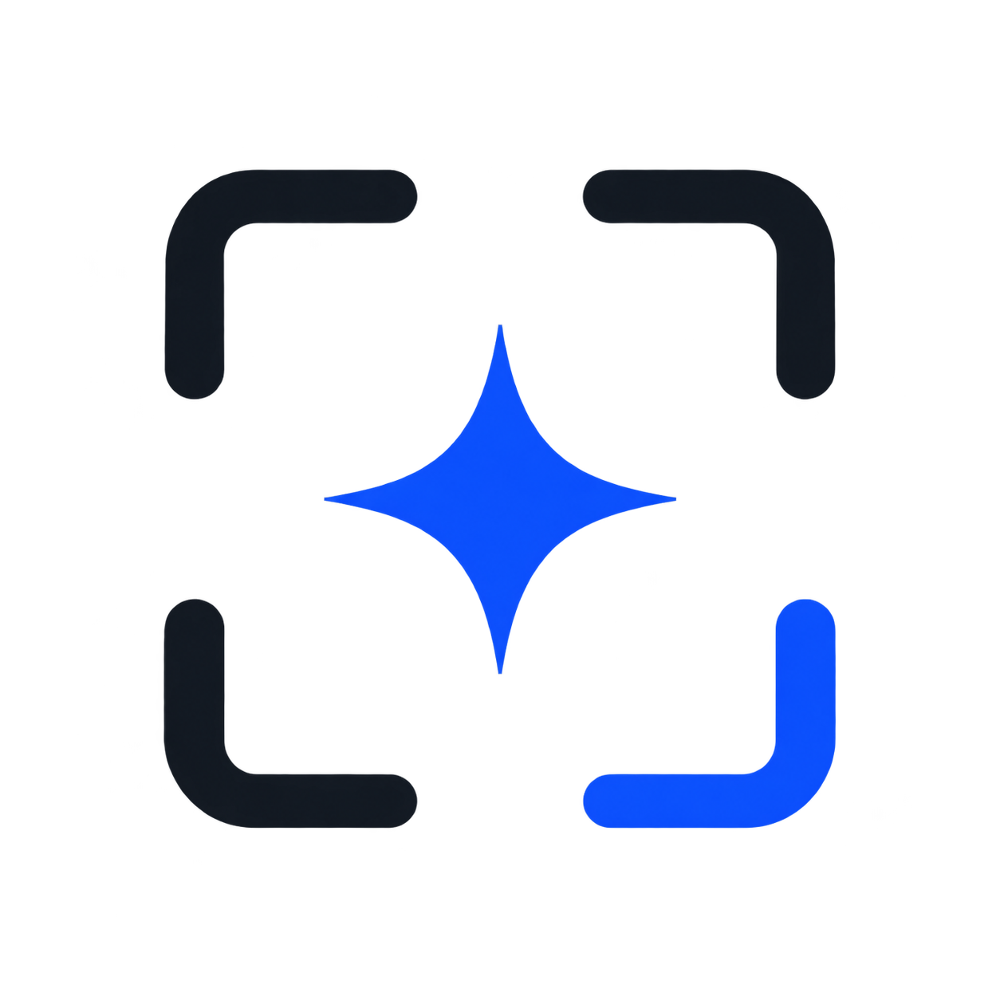

<p align="center">
  
</p>

<h1 align="center">Capster</h1>

<p align="center">
    The macOS screen recorder for the rest of us - always free and open source with a native look and feel 📺
</p>

<p align="center">
  <a href="#installation">Installation</a> ·
  <a href="#features">Features</a> ·
  <a href="#whats-new-in-capster">What's New</a> ·
  <a href="#contributing">Contributing</a>
</p>

> **Capster is a fork of [BetterCapture](https://github.com/jsattler/BetterCapture) by Joshua Sattler**, extended with recording pause/resume, cancellation, a pre-recording countdown, single-track mixed audio, and more. See [What's New in Capster](#whats-new-in-capster) below - the same attribution is also shown in the app's own Settings → About tab.

## Features

- **Native macOS integration**: Built with SwiftUI and ScreenCaptureKit, lives in your menu bar
- **Professional encoding**: ProRes 422/4444, HEVC (H.265), and H.264 codecs with support for alpha channel and HDR
- **Flexible audio capture**: Record system audio and microphone simultaneously, mixed into a single playable track
- **Content filtering**: Exclude specific content from recordings
- **Privacy-focused**: No tracking, no analytics, all recordings stored locally
- **MIT licensed**: Free and open source

## What's New in Capster

Changes on top of upstream BetterCapture:

- **Pause / Resume**: pause an in-progress recording and resume later - paused time is cleanly cut from the output instead of leaving a frozen-frame gap
- **Cancel Recording**: discard the current recording entirely (deletes the in-progress file) instead of only being able to stop-and-save
- **Pre-recording countdown**: optional 3-second "get ready" countdown overlay before capture starts, skippable with any key press or click
- **Presenter Overlay assist**: macOS gives apps no API to turn on Presenter Overlay automatically - Capster now pauses right after starting the share and prompts you to enable it manually from Control Center, then resumes once you confirm, instead of silently recording without it
- **Fixed silent/missing microphone audio**: system audio and microphone are now mixed into a single audio track (previously, writing them as two separate tracks meant most players only played the first one back, making the mic sound silent or missing); also fixed the mic silently failing when the previously-selected device was no longer available
- **Configurable output filename**: set your own filename template with `{date}`/`{time}` placeholders and a live preview, instead of a fixed naming scheme
- **Cleaner shutdown**: quitting (Quit button, ⌘Q, Dock, logout) now properly finishes or stops an in-progress recording first, instead of leaving the screen-sharing session stuck active in the background

## Installation

No prebuilt releases are published for this fork yet, so for now it has to be built and run from source using Xcode. You don't need any programming experience for this - just follow the steps below.

### What you'll need

- A Mac running **macOS 15.2 (Sequoia) or later**
- **[Xcode](https://apps.apple.com/us/app/xcode/id497799835)** - free from the Mac App Store. It's a large download (10+ GB), so kick it off with time to spare
- Your own **Apple ID** - free, no paid developer account needed to run the app on your own Mac

### Step-by-step

1. **Install Xcode** from the Mac App Store if you don't already have it, then open it once and let it finish any first-time setup.

2. **Download this project**. Either:
   - Go to [this repo's GitHub page](https://github.com/renan-brasilio/BetterCapture), click the green **Code** button → **Download ZIP**, then double-click the downloaded file to unzip it, or
   - If you're comfortable with Terminal:
     ```bash
     git clone https://github.com/renan-brasilio/BetterCapture.git
     ```

3. **Open the project**: inside the downloaded/unzipped folder, double-click `BetterCapture.xcodeproj`. This opens Xcode.

4. **Sign in with your Apple ID in Xcode** (one-time only, needed to run any app you build yourself):
   - In the menu bar at the top of the screen: **Xcode → Settings…** (or press ⌘,)
   - Click the **Accounts** tab
   - Click the **+** button in the bottom-left corner → **Sign in with your Apple ID**
   - This is completely free - you don't need to pay Apple anything to build and run the app on your own Mac

5. **Point the project at your account**:
   - In the left sidebar (the file list), click the blue **BetterCapture** project icon at the very top
   - In the main panel, select the **BetterCapture** target (under "TARGETS")
   - Click the **Signing & Capabilities** tab
   - Under **Team**, open the dropdown and choose **[Your Name] (Personal Team)**

6. **Run it**: at the top of the Xcode window, make sure the box next to the scheme name says **My Mac**, then click the ▶ **Run** button in the top-left corner (or press ⌘R). Xcode will build the app and launch it - this first build can take a minute or two.

7. **Find it**: Capster has no icon in the Dock and doesn't open a window - it lives only in the **menu bar** (top-right of your screen, near the clock and Wi-Fi icons). Look for its icon there once it finishes launching.

8. **Grant permissions**: the first time you try to record, macOS will ask for Screen Recording access (and Microphone/Camera if you use those features). Approve each prompt as it appears - you may need to click **Start Recording** a second time right after granting Screen Recording access, since macOS requires that.

### Keeping it around permanently

Running via ⌘R launches a temporary build that disappears if Xcode cleans up after itself. To install a copy that stays in your Applications folder like a normal app:

1. After a successful Run, go to Xcode's **Product** menu → **Show Build Folder in Finder**
2. Open the `Products` folder, then `Debug`
3. Drag `BetterCapture.app` into your `/Applications` folder (feel free to rename it to `Capster.app` - the app itself already displays as "Capster" regardless of the file's name)

From then on, launch it directly from Applications or Spotlight without needing to open Xcode again, unless a new code change needs building.

## Automation

Capster supports a custom URL scheme for external tools (Raycast, Shortcuts, Alfred):

| URL | Action |
|---|---|
| `capster://toggle` | Stop recording if active; otherwise open content selection (Pick Content or Select Area) before recording |
| `capster://toggle-copy` | Same as `toggle`, but copies the saved recording to the clipboard when stopping |
| `capster://open-recordings` | Open the output folder in Finder |

Example:

```bash
open "capster://toggle"
```

## Contributing

We welcome contributions of all kinds! Please see our [Contributing Guidelines](CONTRIBUTING.md) for more details on how to get involved.

## Acknowledgments

Special thanks to these projects for their excellent work and inspiration:

- [**BetterCapture**](https://github.com/jsattler/BetterCapture) by Joshua Sattler - the original project this is forked from
- [**QuickRecorder**](https://github.com/lihaoyun6/QuickRecorder)
- [**Azayaka**](https://github.com/Mnpn/Azayaka)
- [**Ghostty**](https://github.com/ghostty-org/ghostty)

## License

This project is licensed under the MIT License - see the [LICENSE](LICENSE) file for details.
